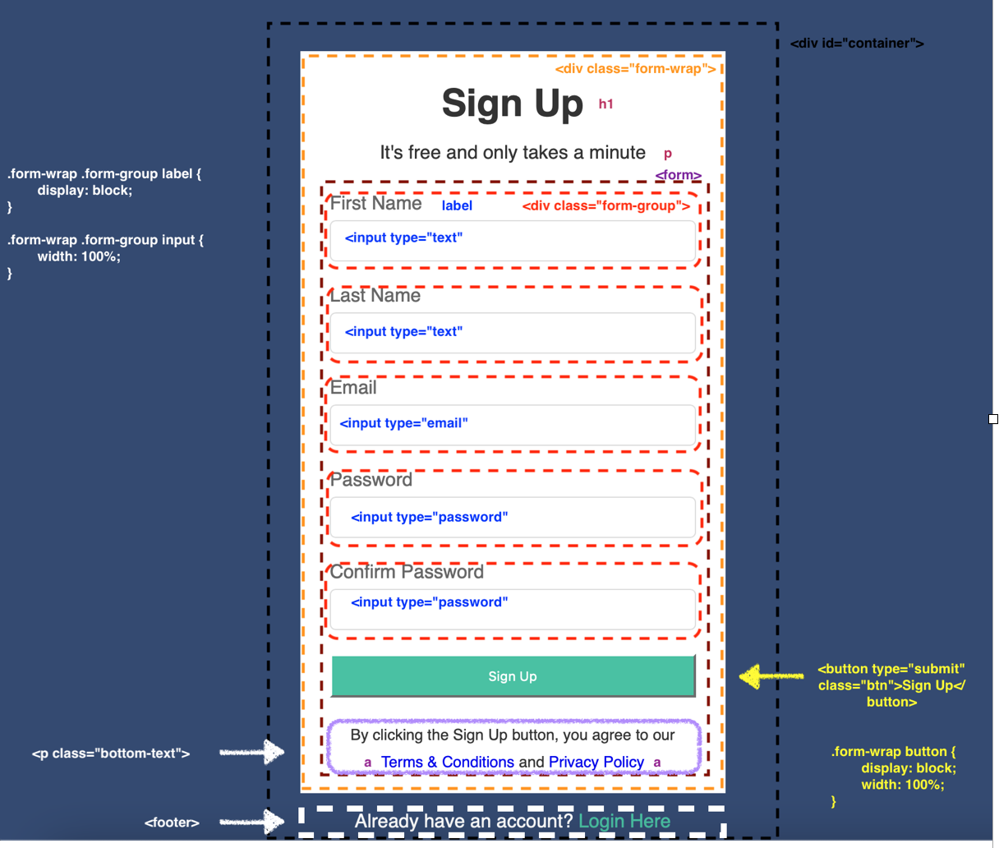

## HTML

## HTML + CSS

## \*

- Добавим box-sizing чтобы padding не влиял на размеры
- Сбрасываем margin и padding

## body

- Синий фон,шрифт

## a

Убираем некрасивый CSS всех ссылок :)

## #container

- сужаем по ширине
- max-width для responsiveness
- внутренний отступ

## .form-wrap

- белый фон
- внутренний отступ

## .form-wrap h1, .form-wrap p

- Заголовок и текст по центру

## .form-wrap .form-group

- отступ сверху для каждого поля

## .form-wrap .form-group label

- превращаем в block element

## .form-wrap .form-group input

- поля для ввода расширяем
- внутренний отступ
- добавляем границы и округляем их

## .form-wrap button

- превращаем в block element
- Расширить кнопку
- внутренний отступ
- фон
- Указатель при наведении

## .form-wrap button:hover

- Цвет ссылки при наведении

## .form-wrap .bottom-text

- Текст мельче
- отступ сверху

## footer

- По центру
- отступ сверху

## footer a

- Синие ссылки footerr
